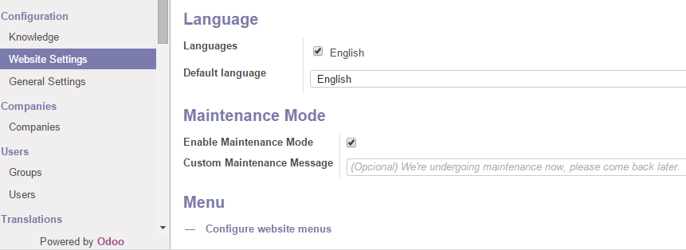

website_maintenance
==========

Odoo module to take website down for maintenance

This module can be useful if don't want to show your website contents.

Screenshots
==========

Website Offline

Settings window

